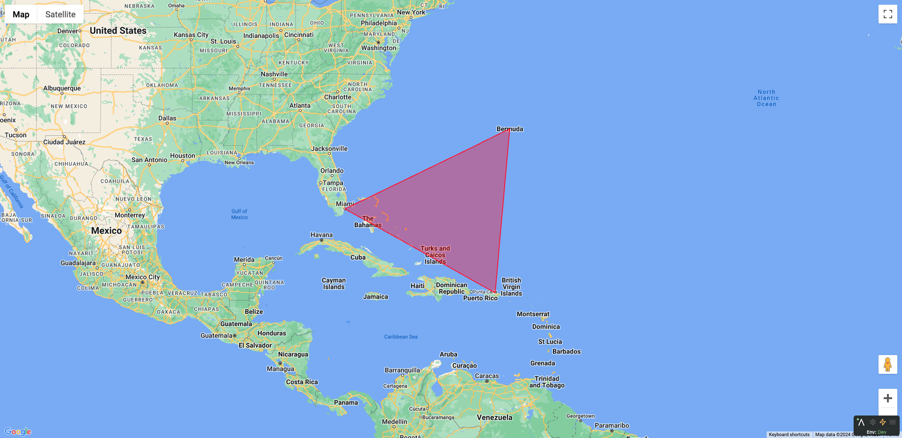

# Google Maps in Lamdera

This is a very simple demo project to show how to use Google Maps in Lamdera using Web Components. It is heavily inspired by the [Google Maps documentation](https://developers.google.com/maps/documentation/javascript/shapes#polygon_add).



⚠️ This proof of concept is very incomplete: it only displays a map with a polygon.

## Setup

Add your own Google Maps API key in `public/index.js`.

## Run

```zsh
lamdera live
```
